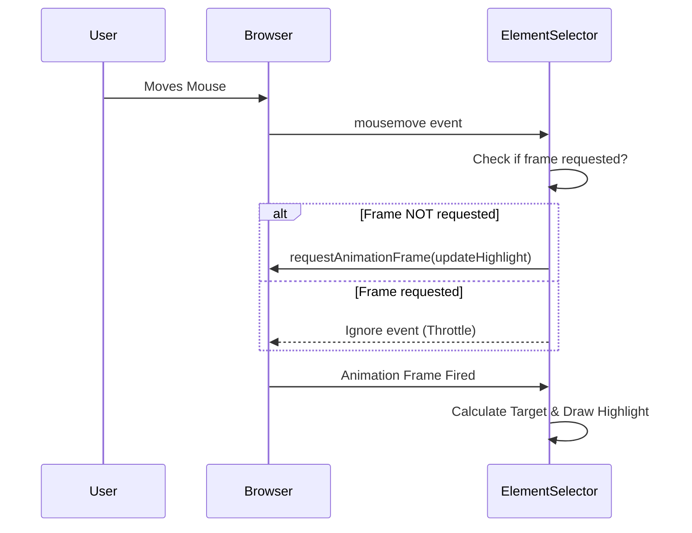
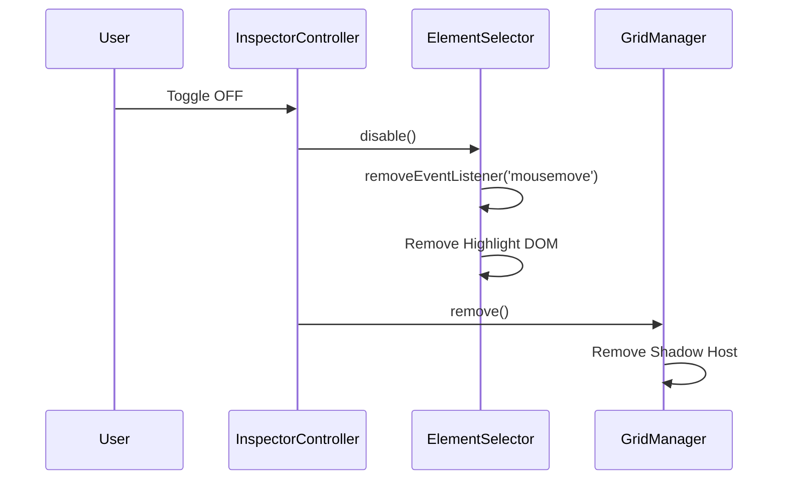

# Epic Technical Specification: Core Stabilization & Launch Prep

Date: 2025-11-25
Author: BMad
Epic ID: epic-2
Status: Draft

---

## Overview

Epic 2 focuses on stabilizing the core functionality developed in Epic 1 and preparing the extension for its initial v1.0 launch. This involves critical performance optimizations to ensure smooth 60fps operation during interactions and a comprehensive packaging workflow to generate production-ready assets for the Chrome Web Store. The goal is to transform the functional MVP into a polished, performant, and distributable product.

## Objectives and Scope

**In Scope:**
*   **Performance Optimization:** Implementation of `requestAnimationFrame` throttling for high-frequency events (mousemove).
*   **Stability:** Robust handling of window scroll and resize events to maintain grid alignment and visual integrity.
*   **Resource Management:** Prevention of memory leaks through rigorous event listener cleanup upon extension deactivation or context switching.
*   **Asset Preparation:** Creation and inclusion of all required extension icons (16px, 32px, 48px, 128px).
*   **Packaging:** Configuration of `manifest.json` metadata and implementation of an automated build script (`npm run package`) to produce a valid `.zip` artifact for the Chrome Web Store.

**Out of Scope:**
*   New feature development (e.g., global shortcuts, settings UI - deferred to Epic 3).
*   Mobile browser support.
*   End-to-End (E2E) automated testing.

## System Architecture Alignment

This epic directly supports the architectural goals of **"Performance (60fps)"** and **"Simplicity"** outlined in the Architecture Document.

*   **Content Script Optimization:** Refines `ElementSelector.js` and `InspectorController.js` to adhere to the non-blocking interaction requirement.
*   **Lifecycle Management:** Enforces the "Clean Up" principle in the `InspectorController` singleton to prevent memory bloat, crucial for a long-running browser extension.
*   **Build Pipeline:** Leverages **Vite** and **@crxjs/vite-plugin** to streamline the production build process, ensuring code minification and proper manifest generation.

## Detailed Design

### Services and Modules

| Module | Responsibility | Changes Required |
| :--- | :--- | :--- |
| `src/content/ElementSelector.js` | Handles hover detection and highlighting. | Refactor `mousemove` listener to use `requestAnimationFrame`. Ensure `remove()` method clears all listeners. |
| `src/content/InspectorController.js` | Global state and lifecycle management. | Implement comprehensive `deactivate()` method that triggers cleanup across all child modules. |
| `src/content/GridManager.js` | Manages grid overlay injection. | Verify `direct child injection` stability during scroll/resize. Implement `updatePosition()` if necessary (though architecture suggests natural scrolling). |
| `package.json` | Project configuration and scripts. | Add `package` script to run build and zip the output. |
| `manifest.js` | Manifest configuration source. | Update with full metadata (version, description, icons). |

### Data Models and Contracts

**Manifest V3 (`manifest.json`) Structure:**
```json
{
  "manifest_version": 3,
  "name": "WP 14px Rhythm Inspector",
  "version": "1.0.0",
  "description": "Inspect 14px grid alignment on WordPress elements.",
  "icons": {
    "16": "assets/icon-16.png",
    "32": "assets/icon-32.png",
    "48": "assets/icon-48.png",
    "128": "assets/icon-128.png"
  },
  "action": {
    "default_icon": "assets/icon-16.png"
  },
  "permissions": ["activeTab", "storage", "scripting"]
}
```

### APIs and Interfaces

*   **`window.requestAnimationFrame(callback)`**: Used for throttling visual updates.
*   **`EventTarget.removeEventListener(type, listener)`**: Critical for cleanup.
*   **`ResizeObserver`**: (Optional) May be used to detect target element size changes if window resize events are insufficient.

### Workflows and Sequencing

**1. Optimized Hover Loop:**


**2. Deactivation & Cleanup:**


## Non-Functional Requirements

### Performance
*   **Frame Rate:** Hover highlighting and grid scrolling must maintain **60fps** on standard hardware.
*   **CPU Usage:** Idle CPU usage must be near 0% when the extension is active but the user is not interacting.

### Security
*   **Content Security Policy (CSP):** Default Manifest V3 CSP. No remote code execution.

### Reliability/Availability
*   **Memory Safety:** Repeated toggling of the extension must not increase heap size (no detached DOM nodes or zombie listeners).

### Observability
*   **Console Logging:** Minimal logging in production. "WP Inspector Ready" log on load (as per Epic 1) is acceptable, but debug logs should be stripped.

## Dependencies and Integrations

*   **Runtime Dependencies:** None (Vanilla JS).
*   **Dev Dependencies:**
    *   `vite`: ^5.4.21 (Build tool)
    *   `@crxjs/vite-plugin`: ^2.2.1 (Manifest handling)
    *   `zip` (or equivalent node script): For packaging.

## Acceptance Criteria (Authoritative)

1.  **Throttled Interaction:** All `mousemove` events for highlighting are throttled using `requestAnimationFrame`.
2.  **Scroll/Resize Stability:** The grid overlay and measurement tool (if active) maintain correct positioning relative to the target element during page scroll and window resize.
3.  **Clean Lifecycle:** Disabling the extension or switching target elements removes all attached Event Listeners and DOM nodes, returning the page to its original state.
4.  **Icon Assets:** The extension includes valid 16px, 32px, 48px, and 128px icons in the `assets` folder.
5.  **Manifest Metadata:** The `manifest.json` contains the correct name, version, description, and icon references.
6.  **Production Build:** Running `npm run package` (or equivalent) successfully generates a `dist` folder and a `.zip` file containing the optimized, minified extension ready for upload.

## Traceability Mapping

| Acceptance Criteria | Spec Section | Component(s) | Test Idea |
| :--- | :--- | :--- | :--- |
| AC1: Throttled Interaction | Detailed Design / Workflows | `ElementSelector.js` | Performance profile recording; verify function call frequency matches framerate. |
| AC2: Scroll/Resize Stability | Detailed Design / Modules | `GridManager.js` | Manual test: Lock grid, scroll page fast, resize window. Grid should stick. |
| AC3: Clean Lifecycle | Detailed Design / Workflows | `InspectorController.js` | Heap snapshot comparison: Toggle on/off 10 times, check for listener count increase. |
| AC4: Icon Assets | Detailed Design / Data Models | `assets/` | Visual check of files; load extension in Chrome and verify icon visibility. |
| AC5: Manifest Metadata | Detailed Design / Data Models | `manifest.js` | Inspect generated `manifest.json` in `dist` folder. |
| AC6: Production Build | Detailed Design / Modules | `package.json` | Run command, unzip result, try to "Load Unpacked" the unzipped folder. |

## Risks, Assumptions, Open Questions

*   **Assumption:** The "Direct Child Injection" strategy (Epic 1) is sufficient for scroll syncing without complex recalculations.
*   **Risk:** `z-index` conflicts might still occur if the target element creates a new stacking context that clips the overlay.
    *   *Mitigation:* Document limitation; advise users to inspect parent containers if clipping occurs.
*   **Question:** Do we need a specific library for zipping, or can we use a simple shell command?
    *   *Decision:* Use a cross-platform node script or simple shell command if environment allows. For now, assume standard shell `zip` or a lightweight node package if needed.

## Test Strategy Summary

### Automated Tests
*   **Unit Tests:** Verify cleanup logic (mocking `removeEventListener`).
*   **Build Verification:** Script to check if `dist/manifest.json` exists and is valid JSON.

### Manual Verification
*   **Performance Testing:** Use Chrome DevTools Performance tab to ensure no "Long Tasks" during hover.
*   **Memory Testing:** Use Memory tab to check for detached DOM nodes after deactivation.
*   **Installation Testing:** Load the generated `.zip` (unpacked) into a fresh Chrome profile to verify assets and metadata.

## Post-Review Follow-ups

The senior developer review for Story 2.1 produced a small set of low-severity follow-ups to track across the epic and backlog:

- [ ] [Low] Make `GridManager.z-index` configurable or document the expected z-index policy to avoid conflicts with other extensions or host page components. (file: src/content/modules/GridManager.js:11-12) — Story: 2.1
- [ ] [Low] Replace system `zip` in the `package` script with a Node-based cross-platform packaging step (e.g., npm package 'archiver' or 'zip-dir') to make CI packaging portable across operating systems. (file: package.json:9) — Story: 2.1
- [ ] [High] Add a CI workflow to run `npm run package` and verify the resulting `dist.zip` contains `manifest.json` at the archive root and the required `src/assets` icons. This ensures packaging is validated in CI, not only locally. — Story: 2.2
